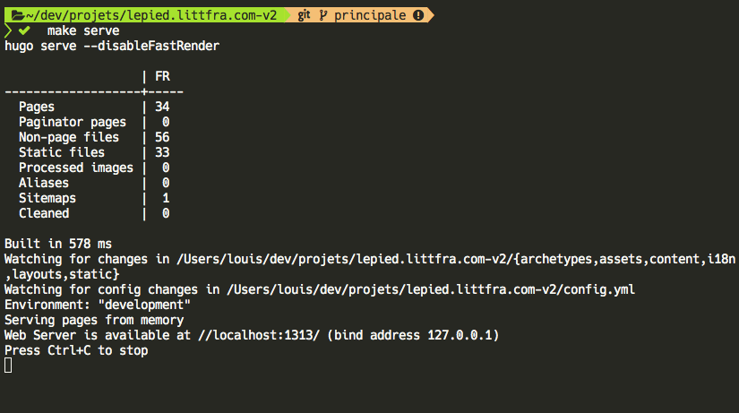

# lepied.littfra.com

Nouveau site web du Pied, la revue de création des étudiant·e·s en littératures de langue française de l’Université de Montréal.

## Outils

- [Hugo](https://gohugo.io/) – génerateur de site statique, en ligne de commande
- [NodeJS](https://nodejs.org/) – environnement de programmation JavaScript



## Développement

Pour développer les feuilles de style, il faut installer les dépedances [NodeJS](https://nodejs.org/) avec son compagnon [npm](https://www.npmjs.com/):

```bash
npm i
```

Pour développer les styles, ouvrir un terminal séparément:

```bash
npm run serve:styles
```

Pour consruire les styles pour production (avec optimisation):

```bash
npm run serve:styles
```

## Local

```bash
make serve # ouvre un aperçu local à http://localhost:1313
```

## Production

Pour produire les fichiers dans le dossier `public/`:

```bash
make build
```

## Déploiement

Avec le logiciel Rsync installé, il suffit de lancer:

```bash
make deploy
```

ou encore,
commande 2 en 1 qui combine production + déploiement:

```bash
make all
```

## Licence

CC-BY-NC-ND 4.0

