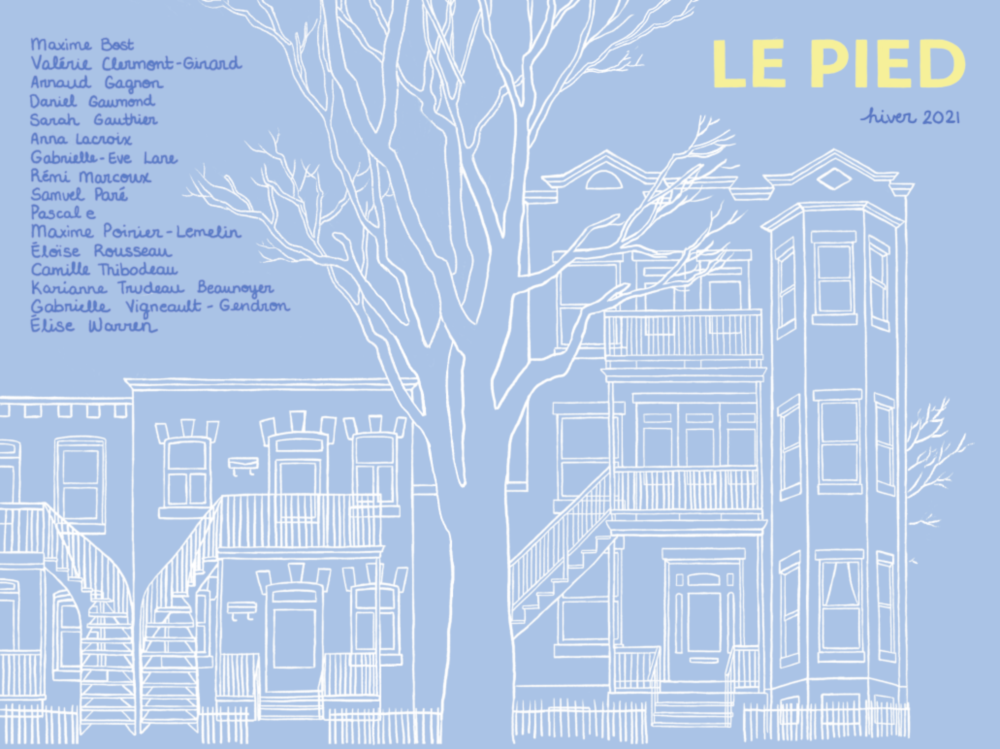

[pdf compressé (4,5 Mo)](le-pied-hiver-2021-compress.pdf)

[pdf avec photographies originales (49 Mo)](le-pied-hiver-2021-compress.pdf)

ISSN 2561-3464 (imprimé)  
ISSN 2561-3472 (en ligne)

## Rédaction
- Évelyne Ménard, _rédactrice en chef_
- Éléonore Meunier, _secrétaire de rédaction_

## Édition et révision
- Arnaud Gagnon, _éditeur_
- Audrey-Ann Gascon, _éditrice_
- Joëlle Marcotte, _éditrice_
- Sarah-Jeanne Beauchamp-Houde, _réviseure_

## Comité de lecture
- Sandrine Bienvenu
- Océane Corbin
- Laurie Daoust St-Jacques
- Chloé Dassylva
- Amélie Fortin
- Daniel Gaumond
- Sarah Gauthier
- Fred Gosselin
- Sanna Mansouri
- Eugénie Matthey-Jonais
- Laurie Michaud
- Louise Nayagom
- Augustine Poirier
- Maxime Poirier-Lemelin
- Adrien Savard-Arsenault

## Autrice en résidence
- Karianne Trudeau Beaunoyer

## Collaboration à ce numéro
- Maxime Bost
- Valérie Clermont-Girard
- Arnaud Gagnon
- Daniel Gauond
- Sarah Gauthier
- Anna Lacroix
- Gabrielle-Ève Lane
- Rémi Marcoux
- Samuel Paré
- Pascal e
- Maxime Poirier-Lemelin
- Éloïse Rousseau
- Camille Thibodeau
- Gabrielle Vigneault-Gendron
- Élise Warren

## Diffusion et organisation des évènements
- Amélie Fortin, _responsable_

## Rédaction web
- Louis-Olivier Brassard, _rédacteur web_

## Infographie
- Maude Ouellete, _mise en page_
- Daniel Gaumond, _révision finale_

## Couverture
Judith Ménard ([@jude.it](https://www.instagram.com/jude.it))  
Dessin numérique, 2020

## Illustrations
Vincent Morreale ([@morreale94](https://www.instagram.com/morreale94))  
« Ces espaces qui nous ressemblent »  
Technique mix ; photographie argentique (35mm, format médium) et numérique (ilford HP5 et émulation du style), 2020

## Impression
Mardigrafe inc.

## Licence
Creative Commons BY-NC
