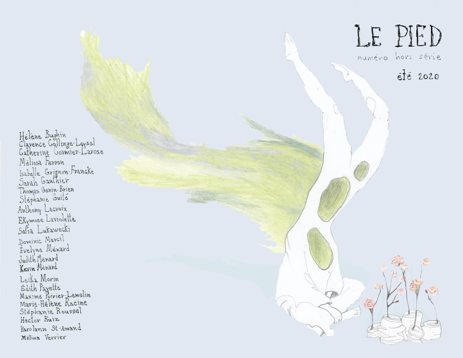

[pdf régulier (24 Mo)](lepied-hors-serie-2020.pdf)

[pdf diète (compressé, 1,2 Mo)](lepied-hors-serie-2020-compress.pdf)

## Rédaction
Karolann St-Amand, _rédactrice en chef_

## Édition et révision
Audrey-Ann Gascon, _éditrice_  
Évelyne Ménard, _éditrice_  
Sarah-Jeanne Beauchamp-Houde, _réviseure_

## Auteur·e·s en résidence
Hélène Bughin, Catherine Cormier-Larose, Anthony Lacroix, Dominic Marcil, Stéphanie Roussel, Hector Ruiz

## Collaboration à ce numéro
Clarence Collinge-Loysel, Mélissa Ferron, Isabelle Grignon-Francke, Sarah Gauthier, Thomas Genin- Brien, Stéphanie Guité, Ekymose Laviolette, Safia Lukawecki, Évelyne Ménard, Judith Ménard, Kevin Ménard, Leïka Morin, Édith Payette, Maxime Poirier-Lemelin, Marie-Hélène Racine, Karolann St- Amand, Mélina Verrier

## Rédaction web

Louis-Olivier Brassard, _rédacteur web_

## Infographie
Camille Anctil-Raymond, _mise en page_  
Alexis Penaud, _responsable du visuel_

## Prix pour ce numéro

_(vous pourrez aussi [voter pour le prix du public]()!)_
